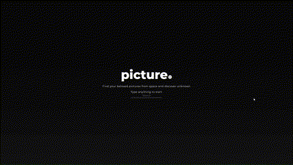

# picture_app



```sh
#Project setup
npm install

#Compiles and hot-reloads for development
npm run serve

#Compiles and minifies for production
npm run build

#Lints and fixes files
npm run lint
```

## ToDo:
- [ ] Add Backend app that handles requests to NASA https://github.com/lickerish/picture_app/issues/3
- [ ] Add Edge backend app that handles authorization https://github.com/lickerish/picture_app/issues/4
- [ ] Add cache on FE or BE https://github.com/lickerish/picture_app/issues/5